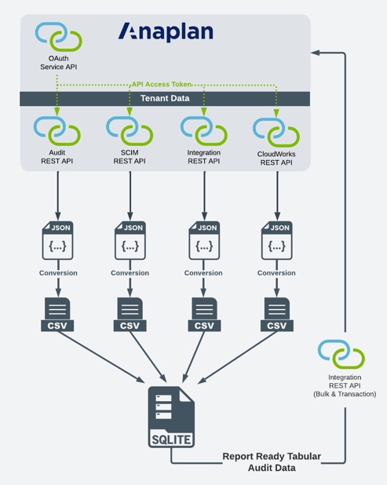

# Anaplan Audit History
A Python project that provides the ability to fetch Anaplan audit history and format the data into a meaningful and reportable format and load that data an Anaplan Reporting Model.

## Table of Contents

- [Overview](#overview)
- [Features](#features)
- [Deployment](#deployment--requirements)
- [Usage](#usage)
- [Tests](#tests)
- [Credits](#credits)
- [License](#license)
- [How to Contribute](#how-to-contribute)

## Overview
This project is a combination of technologies to extract [Anaplan Audit events](https://help.anaplan.com/ef0ac1f3-fd1d-4dc2-a205-2ae4f5b22a7d-Tracked-user-activity-events) from an Anaplan tenant and convert this data into a meaningful and reportable format. 

The technologies used include the following:
* Interface with most of the Anaplan REST APIs (OAuth Service API, Integration API, Audit API, SCIM API, and CloudWorks API).
* Use Python Pandas to convert data from a web services format (JSON) to tabular data frames.
* Leverage SQLite to transform and blend various record sets into a clean reportable format prior to uploading to Anaplan.

A link to the GitHub repository can be viewed [here](https://github.com/qkeddy/anaplan-audit-history).

## Features

### Usage of different Anaplan APIs
In order to provide Anaplan audit data in a reportable and meaningful format, the following Anaplan REST APIs needed to be leveraged:
* **OAuth Service API** - to authenticate and refresh the `access_token` based on the `client_id` and `refresh_token`.
* **Audit API** - to fetch the audit records.
* **Integration API** - to fetch metadata about Anaplan objects such as `data sources`, `Processes`, and `Actions`. Additionally, to refresh content to the target Anaplan Audit Reporting Model, the bulk API is used to upload the report-ready audit data and the transaction API is leveraged for updating the latest timestamp.
* **SCIM API** - to fetch Anaplan user metadata.
* **CloudWorks API** - to fetch CloudWorks integration metadata.

Here is an illustration of the APIs used:

### Leverages SQL for Advanced Transformation
In order to transform and combine data into a reporting format, standard ANSI SQL is leveraged to perform all the required data transformations prior to loading and reporting the data in Anaplan. The [SQL](https://github.com/qkeddy/anaplan-audit-history/blob/main/audit_query.sql) reads from SQLite tables that are dynamically generated.

### Converts REST API Web Services data to a tabular format
Python Pandas is used to convert Anaplan data retrieved in a web services format (JSON) to tabular data frames. In turn this data can be directly loaded to a relational database or to targets such as Anaplan. 

### Support for Extended Audit History and Incremental Updates
Anaplan maintains a maximum of 30 days of audit history. By storing the audit history in a SQLite database, history beyond the 30 days can be preserved. This history can grow with incremental updates of the audit data since the last execution run. 

### Detailed logging 
All Anaplan REST API interactions and operations are logged to a daily log that can be used for ongoing monitoring. The log is stored in the project directory.

## Deployment & Requirements
1. Fork and clone project repo.
2. Runtime environment requires `Python 3.11.1` or greater.
3. Using `pip install`, download and install the following Python libraries
`pandas`, `pytz`, `pyjwt`*, `requests` and `apsw`.
4. Create an Anaplan device authorization code grant. More information is available [here](https://help.anaplan.com/2ef7b883-fe87-4194-b028-ef6e7bbf8e31-OAuth2-API).
5. Assign the Anaplan user executing the runtime the role of [Tenant Auditor](https://help.anaplan.com/e4588d12-fb85-4064-b204-677c603713a7-Tenant-auditor).
6. Review the `settings.json` file and set the following values: 
    - Set the ` "rotatableToken"` key to either `true` or `false` depending on how your `Device Grant OAuth Client` has been configured. Note this implementation only supports Device Grant OAuth Clients.
    - Depending on your Anaplan instance, please review the `"uris"` key and update any base URI depending on your Anaplan region. 
    - Update the `"anaplanTenantName"` to the name of your tenant.
    - Under the `"targetAnaplanModel"` key, update the name of your Workspace and Model. Please use the actual Workspace and Model names and ***not*** the IDs.
    - If there is ever the requirement to reset the extracted audit data, set the `"lastRun"` to `0`

* Note - if you previously installed `jwt`, you will need to perform a `pip uninstall jwt` ***before*** you install `pyjwt`.

## Usage

1. When executing the first time on a particular device, open the CLI in the project folder and run `python3 Main.py -r -c <<enter Client ID>>`. This will return a unique URI that needs to be opened with browser that has never logged into Anaplan (e.g. Chrome Incognito Browser). The OAuth workflow will then require an Anaplan non-SSO (exception user) to login to Anaplan to authenticate and register the device ID. 

2. After the above step, the script can be executed unattended by simply executing `python3 Main.py`.

3. To see all command line arguments, start the script with `-h`.

4. To update any of the Anaplan API URLs or other Anaplan Model configurations, please edit the file `settings.json` stored in the project folder.

Note: The `client_id` and `refresh_token` are stored as encrypted and salted values in a SQLite database that is automatically created upon execution. As an alternative, solutions like [auth0](https://auth0.com/) or [Amazon KMS](https://aws.amazon.com/kms/) would further enhance security. 

## Tests
Currently, no automated unit tests have been built. 

## Credits
- [Quinlan Eddy](https://github.com/qkeddy) - Primary development of the Python code
- [Chris Stauffer](https://www.linkedin.com/in/jcstauffer/) - Data design, requirements settings, and the build of the Anaplan Reporting Model

## License
MIT License

Copyright (c) 2023 Quin Eddy

Permission is hereby granted, free of charge, to any person obtaining a copy
of this software and associated documentation files (the "Software"), to deal
in the Software without restriction, including without limitation the rights
to use, copy, modify, merge, publish, distribute, sublicense, and/or sell
copies of the Software, and to permit persons to whom the Software is
furnished to do so, subject to the following conditions:

The above copyright notice and this permission notice shall be included in all
copies or substantial portions of the Software.

THE SOFTWARE IS PROVIDED "AS IS", WITHOUT WARRANTY OF ANY KIND, EXPRESS OR
IMPLIED, INCLUDING BUT NOT LIMITED TO THE WARRANTIES OF MERCHANTABILITY,
FITNESS FOR A PARTICULAR PURPOSE AND NONINFRINGEMENT. IN NO EVENT SHALL THE
AUTHORS OR COPYRIGHT HOLDERS BE LIABLE FOR ANY CLAIM, DAMAGES OR OTHER
LIABILITY, WHETHER IN AN ACTION OF CONTRACT, TORT OR OTHERWISE, ARISING FROM,
OUT OF OR IN CONNECTION WITH THE SOFTWARE OR THE USE OR OTHER DEALINGS IN THE
SOFTWARE.

## How to Contribute

If you would like to contribute to this project. Please email me at qkeddy@gmail.com. If you would like to contribute to future projects, please follow me at https://github.com/qkeddy.

It is requested that all contributors adhere to the standards outlined in the [Contributor Covenant Code of Conduct](https://www.contributor-covenant.org/version/2/1/code_of_conduct/).